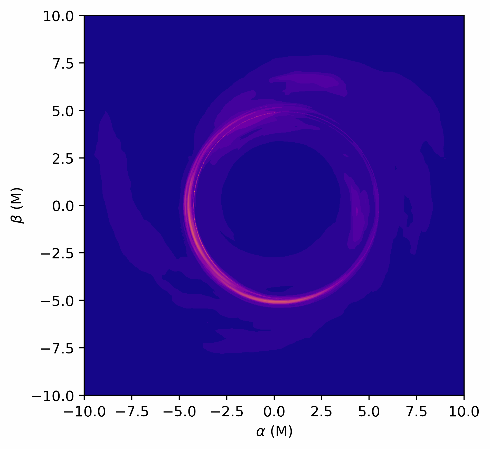

  

# Adaptive Analytical Ray Tracing (AART) #

AART is a numerical framework that exploits the integrability properties of the Kerr spacetime to compute high-resolution black hole images and their visibility amplitude on long interferometric baselines. It implements a non-uniform adaptive grid on the image plane suitable to study black hole photon rings (narrow ring-shaped features predicted by general relativity but not yet observed). 

The code, described in detail in Ref. [1], implements all the relevant equations required to compute the appearance of equatorial sources on the (far) observer's screen. We refer the Reader to Refs. [2-4] for the derivations and further details. Through the code, the equations are mentioned as Pi Eq. N, which means Eq. N in Ref. [i]. 

The use of AART in scientific publications must be properly acknowledged. Please cite:

_______
Cardenas-Avendano, A., Lupsasca, A. & Zhu, H. "Adaptive Analytical Ray Tracing of Black Hole Photon Rings." Phys. Rev. D 107, 043030, 2023. [arXiv:2211.07469](https://arxiv.org/abs/2211.07469) 
_______

We also request that AART modifications or extensions leading to a scientific publication be made public as free software. 

 <em>Feel free to use images and movies produced with this code (with attribution) for your next presentation! </em> 

_______

_______

## AART's Components ##

* **Lensing Bands**: The main functions are located in <em>lb_f.py</em> : This module computes the Bardeen's coordinates inside the so-called lensing bands (currently it only computes ($0\le n\le 2$), and the extension to a higher n is possible: just compy the structure of the code and add the desired n number) on a Cartesian grid with different resolutions. 

* **Analytical Ray-Tracing**: The main functions are located in  <em>raytracing_f</em>: For a given location in the Bardeen's plane ($\alpha,\beta$), it computes where it lands in the equatorial plane ($t,r,\theta=\pi/2,\phi$) in Boyer-Lindquist coordinates. The implementatio does it per lensing band. 

* **Images**: The source functions are located in <em>image.py</em>: It computes an image for a given analytical illumination profile specified in <em>rprofs_f.py</em>, if it is purely radial and analytical, or as an external file. The current version of the code supports <em>inoisy</em> (<https://arxiv.org/abs/2011.07151>) outputs, where the external file is an HDF5 with an specific structure. In this repo you can find a low-resolution example. 

* **Visibility Amplitudes**: The main functions are located in <em>visamp_f.py</em>: It computes the visibility amplitudes for given intensities over $n$ lensing bands. 

* **Polarization**: For a given magnetic field configuration (specified in the file <em>polarization_f</em>), it parallel transports the linear polarization of a photon.

* **Theta_B**: For a given magnetic field configuration (specified in the file <em>magneticfield_f</em>), it returns the cosine square of the the angle between the field 𝑏𝜇 and photon momentum 𝑘𝜇.

* **Redshift**: For a given geometry it returns the redshift factor. 

## Dependencies ##

#### Python Libraries: 

All the dependencies are located in the <em>init.py</em> file. Most of the libraries will come natively with anaconda (e.g., numpy, scipy >=1.8, matplotlib, multiprocessing, skimage) but some may not. 

To install all requirements*, run

 <code> pip install -r requirements.txt </code>

or, if using anaconda,

 <code> conda install --yes --file requirements.txt </code>

You can also install any missing packages by running
  
<code> pip install "package_name" </code>
  
or, if using anaconda, search for the missing packages and run, e.g. for h5py (Read and write HDF5 files from Python,) 
  
<code> conda install -c anaconda h5py</code>

Sometimes scipy does not update automatically to the latest version. If that is the case, you may want to type 

<code> pip install -U scipy</code>

Some users have experienced an issue with <em>imageio.v2</em>, as it is not found. To solve this issue please type:

<code> python -m pip install --upgrade pip </code>

<code> pip install imageio --upgrade </code>

<em>*Thanks to @prestonyun for suggesting this simplification.</em> 

## How to run AART ##

### As a python package:

Simply [pip](https://pypi.org/project/aart/) install it like this:

<code> pip install aart </code>

In the notebook: 

<em>AARTPackage_Examples.ipynb</em>

the AART package is illustrated. This notebook also includes examples on how to calculate the diameters of the n=2 photon ring and a simple estimate of the spin and inclination of a BH. 

<em>This Python package is maintained by Lennox Keeble, a brilliant Princeton undergraduate, who used aart for his junior paper.</em> 

### From a terminal, using scripts: 

The paramaters are always set in the file <em>params.py</em>. Once that file is modified.

We present some examples in the notebook: 

<em>Examples.ipynb</em>

#### Lensing Bands: 

The lensing bands are computed by simply running

  <code> python lensingbands.py </code>
  
The result will be stored in a HDF5 file that contains the values of the Bardeen's coordinates within each lensing band. The datasets inside the resulting file are:

* alpha: The coordinate alpha of the critical curve. The parameter <em>npointsS</em> controls the number of points used for the computation of the critical curve)
* beta: The coordinate beta of the critical curve. 

* hull\_ni: The points for the inner convex hull of the nth band. Note that hull\_0i corresponds to the location of the apparent horizon. 
hull\_ne: The points for the outer convex hull of the nth band. Note that hull_0e corresponds to edges of the domain.  
* gridn: The point within the nth lensing band. 
* Nn: Number of points within the nth lesing band.
* limn: The grids are cartesian and symmetric around zero. This data sets tells the limits of the grid. 

This image is produced in the example code:

#### Ray Tracing: 

To compute the equitorial radius, angle, and emission time of a photon, we perform a backward ray-tracing from the observer plane. By running the following, we evaluate the source radius, angle, and time within the grid from each lensing bands:

  <code> python raytracing.py </code>
  
The result will be stored in a HDF5 file that contains source radius, angle, time, as well as the radial component of the four momentum at the equitorial plane, for lensing bands n=0,1,2. The datasets inside the resulting file are:

* rsn: The value of the r Boyer-Lindquist coordinate for the nth lensing band. It follows the order of the lensing band. 
* tn: The value of the t Boyer-Lindquist coordinate for the nth lensing band. It follows the order of the lensing band. 
* phin: The value of the \phi Boyer-Lindquist coordinate for the nth lensing band. It follows the order of the lensing band. 
* signn: The sign of the radial momentum of the emitted photon in the nth lensing band. 

This image is produced in the example code:

#### Images: 

##### Stationary and axisymetric source profiles: 

Once the lensing bands and the rays have been computed, an image can be produced using a defined analytical profile by simply running

  <code> python radialintensity.py </code>

The datasets inside the resulting file are:

* bghtsn: The intensity at each point in the image.

This image is produced in the example code:

You can add a custom radial profile in <em>rprofs\_f.py </em>, and modify <em>intensity\_f.py</em> accordingly.

##### Non-stationary and non-axisymetric source profiles: 

As the dataset produced after ray tracing contains all the information of the BL coordinates, one can also use an analytical non-stationary and non-axisymetric source profiles in <em>rprofs\_f.py </em>, and modify <em>intensity\_f.py</em>, <em>iImages.py</em> and <em>iMovies.py</em> accordingly, to produce images (that use the entire history of the profile) and movies. 

One can also use a precomputed equatorial profile. AART currently implements profiles computed with inoisy. The example includes a test case (<em>inoisy.h5</em>), for which one can simply run by 

  <code> python iImages.py </code>
  
  or 
  
  <code> python iMovies.py </code>
  
to produce images or a set of images, respectively. Images can be produced by using a single equatorial profile, i.e., in the mode "stationary," or using the entire history of the equatorial structure, i.e, in the mode "dynamical." When movies are made, the dynamical version is assumed. In both cases, the resulting datasets inside the resulting file are:

* bghtsn: The intensity at each point in the image. When several snapshots are produced, these datasets will have three dimensions, where the first one denotes the time. 

This gif is produced in the example code:

#### Visibility Amplitudes:

With the images created using radial intensity prifiles, one may then calculate the visibility of the image projected onto a baseline. This function first performs radon transforms of the image at a set of specified angles (radonangles in <em>params.py</em>), and then compute the visibility amplitude by 

  <code> python visamp.py </code>

This function creates a set of h5 files, one for each basline angle. These files contains the visibility amplitude as well as the frequency (baseline length in G$\lambda$). The resulting datasets inside the resulting file are:

* freqs: The frequencies where ther vibility amplitude was computed. 
* visamp: The respective visbility amplitdutes. 
* 
If in <em>params.py</em> radonfile=1, the HD5F file also contain these two datasets:

* radon: The resulting radon transformation. 
* x_radon: The axis values of the projection. 

This image is produced in the example code:

#### Polarization:

The linear polarization of a given configuration of the magnetic field can be computed by

  <code> python polarization.py </code>
  
  The resulting datasets inside the resulting file are:

  
  * PK:The Walker-Penrose constant. 
  * EVPA_x: The x-component of the the electric-vector position angle.
  * EVPA_y: The y-component of the the electric-vector position angle.

## Limitations and known possible performance bottlenecks ##

* This code has only been tested on Mac OS (M1 and Intel) and on Ubuntu. 

* If you want to run a retrograde disk, you will have to apply symmetry arguments. In other words, run the positive spin case ($-a$), flip the resulting lensing bands and rays, and then compute the intensity on each pixel. Note that the characteristic radii need also to be modified. We plan to add this feature in a future version. 

* The Radon cut does not smoothly goes to zero. This is sometimes clear from the visamp, where you can see an extra periodicity (wiggle) on each local maxima. To solve this issue, increase the FOV of the $n=0$ image by providing a larger value for the variable <em>limits</em> in <em>params.py</em>. You can also modify the percentage of points used in <em>npointsfit</em> in <em>visamp_f.py</em>.

* Producing the lensing bands is taking too long. Sometimes, in particular for larger inclination values, computing the contours of the lensing bands and the points within it, takes a long time. The calculation can be made faster, but less accurate if you decrease the number of points used to compute the contours, i.e., by decreasing the value of the variable <em>npointsS</em> in <em>params.py</em>. It is faster to compute the convex Hull instead of the concave Hull (alpha shape), but then you will have to check that your are not missing points (having extra points is not an issue with the analytical formulae, as the results are masked out). If using the convex is okay, then you can also change the function <em>in_hull</em> in <em>lb_f.py</em> to use <em>hull.find_simplex</em> instead of <em>contains_points</em>. 

## Authors ##

### Current Developers ###

- Alejandro Cardenas-Avendano (cardenas-avendano [at] lanl [dot] gov)
- Lennox Keeble

### Former Developers ###
- Hengrui Zhu
- Alex Lupsasca

## References ##

[1] Cardenas-Avendano, A., Lupsasca, A. & Zhu, H. Adaptive Analytical Ray Tracing of Black Hole Photon Rings. Physical Review D, 107, 043030, 2023. [arXiv:2211.07469](https://arxiv.org/abs/2211.07469)

[2] Gralla, S. E., & Lupsasca, A. (2020). Lensing by Kerr black holes. Physical Review D, 101, 044031.

[3] Gralla, S. E., & Lupsasca, A. (2020). Null geodesics of the Kerr exterior. Physical Review D, 101, 044032.

[4] Gralla, S. E., Lupsasca, A., & Marrone, D. P. (2020). The shape of the black hole photon ring: A precise test of strong-field general relativity. Physical Review D, 102, 124004.

## MIT License

Permission is hereby granted, free of charge, to any person obtaining a copy of this 
software and associated documentation files (the "Software"), to deal in the Software 
without restriction, including without limitation the rights to use, copy, modify, merge, 
publish, distribute, sublicense, and/or sell copies of the Software, and to permit 
persons to whom the Software is furnished to do so, subject to the following conditions:

The above copyright notice and this permission notice shall be included in all copies 
or substantial portions of the Software.

THE SOFTWARE IS PROVIDED "AS IS", WITHOUT WARRANTY OF ANY KIND, EXPRESS OR IMPLIED, 
INCLUDING BUT NOT LIMITED TO THE WARRANTIES OF MERCHANTABILITY, FITNESS FOR A PARTICULAR 
PURPOSE AND NONINFRINGEMENT. IN NO EVENT SHALL THE AUTHORS OR COPYRIGHT HOLDERS BE LIABLE 
FOR ANY CLAIM, DAMAGES OR OTHER LIABILITY, WHETHER IN AN ACTION OF CONTRACT, TORT OR OTHERWISE, 
ARISING FROM, OUT OF OR IN CONNECTION WITH THE SOFTWARE OR THE USE OR OTHER DEALINGS IN 
THE SOFTWARE.